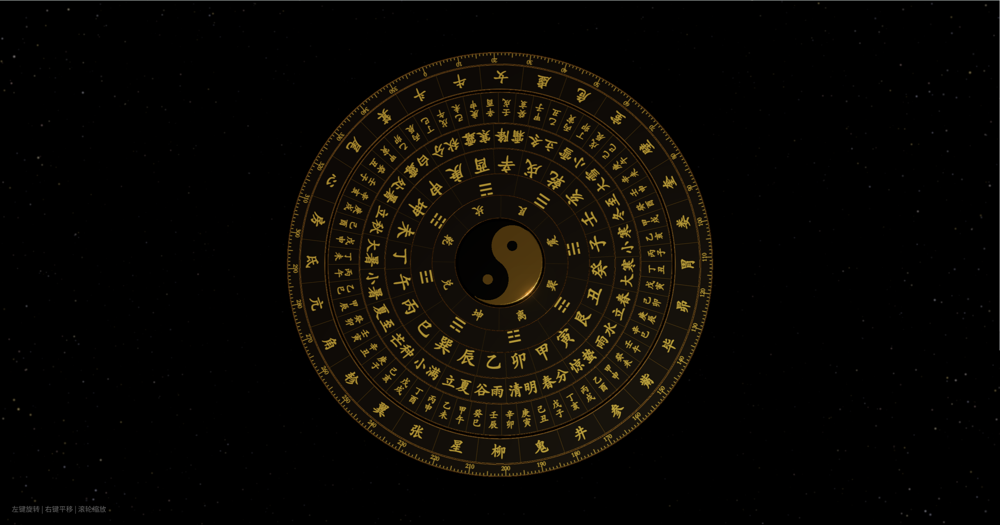

# TaiJi

threejs 太极风水罗盘

## 项目介绍

这是一个使用 Three.js 创建的 3D 太极风水罗盘项目，包含星星闪烁、文字动画、罗盘旋转等效果。

## 项目预览



## 如何运行

1. 克隆或下载此项目
2. 在项目目录中运行 HTTP 服务器，例如：
   ```
   python -m http.server 8000
   ```
3. 在浏览器中访问 `http://localhost:8000`

## 主要功能

1. **星星闪烁效果**：50000 颗星星随机闪烁，部分星星有明显的大小和透明度变化
2. **文字动画**：逐字显示"无极生太极，太极生两仪，两仪生四象，四象生八卦"的哲学思想
3. **3D 罗盘展示**：包含多层旋转的罗盘环，每层有不同的文字和符号
4. **相机动画**：相机由远及近缓慢拉近，增强视觉冲击力
5. **交互控制**：支持鼠标左键旋转、右键平移、滚轮缩放
6. **罗盘旋转**：相机拉近后，罗盘各层开始以不同速度旋转

## 技术栈

- Three.js：3D 渲染引擎
- HTML5 Canvas：用于生成星星和罗盘纹理
- CSS3：用于文字动画效果
- JavaScript：核心逻辑实现
